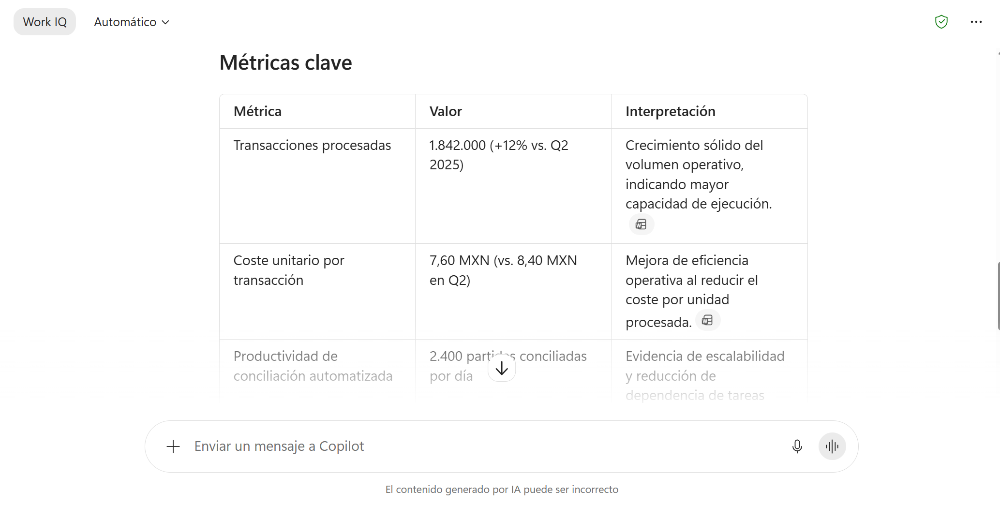
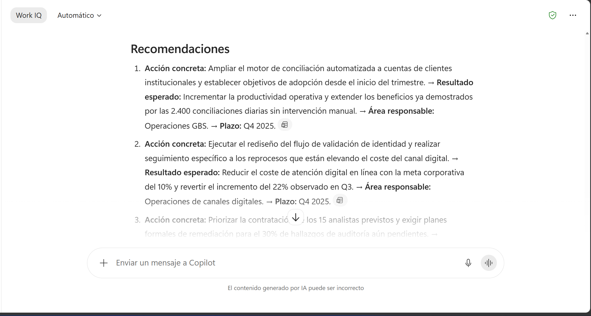
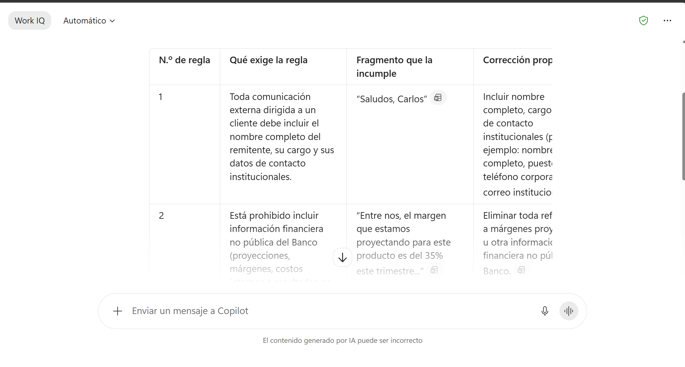
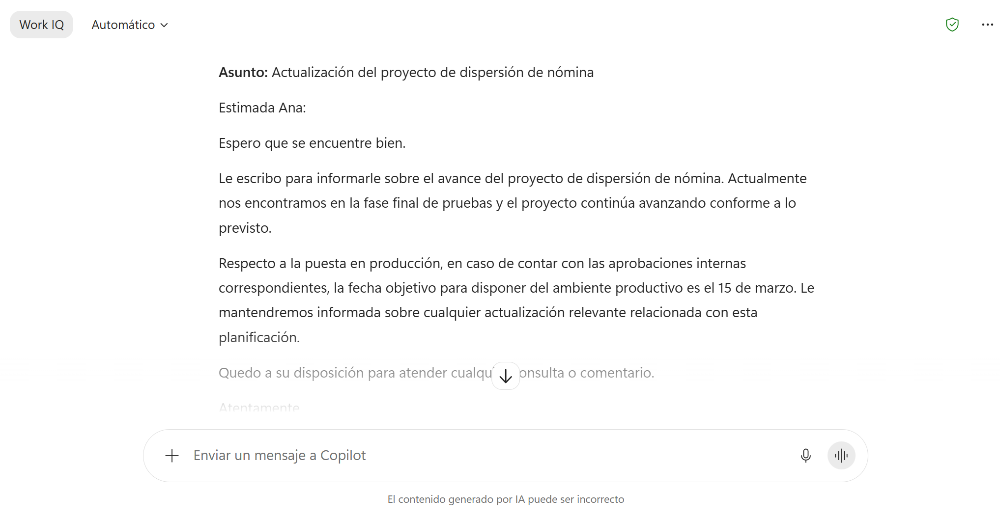
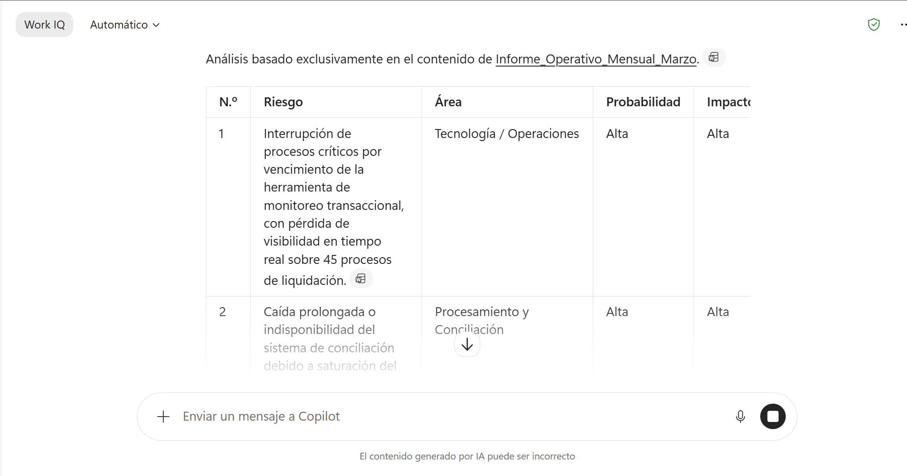
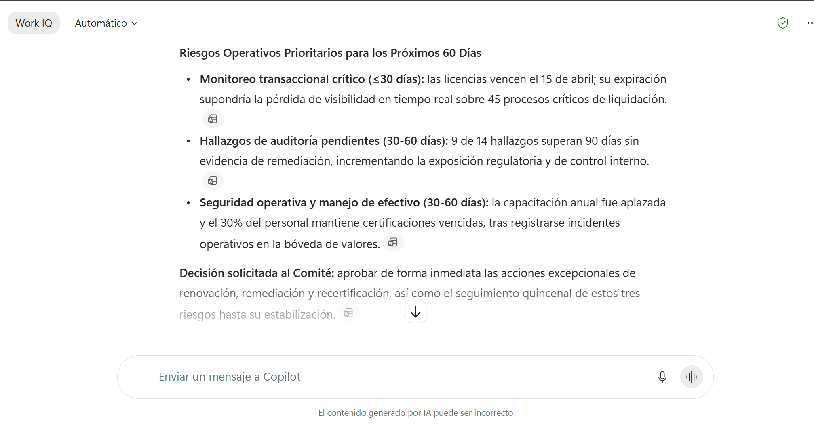

# Capítulo 1 — Ingeniería de prompts

## Antes de empezar (una sola vez, aplica a las tres guías)

1. Sube a OneDrive los archivos de [Datos/Capitulo01/](../Datos/Capitulo01/). Las instrucciones completas están en [Datos/README.md](../Datos/README.md).
2. Abre **https://m365.cloud.microsoft/chat** en Microsoft Edge o Google Chrome e inicia sesión con tu cuenta corporativa.
3. En la parte superior izquierda del chat verás el botón **Work IQ**. Déjalo **activado**. Es lo que permite a Copilot consultar tus archivos, correos y chats con tus permisos. Con Work IQ desactivado, Copilot responde apoyándose en información pública de la web.
4. Si el botón **Work IQ** aparece atenuado, tu cuenta requiere la licencia de Microsoft 365 Copilot. Consúltalo con tu administrador antes de continuar.

> **Cómo adjuntar un archivo al prompt.** Pulsa el símbolo **+** junto al cuadro de texto. Se despliegan las opciones **Agregar contenido de trabajo** (*Add work content*), **Cargar** (*Upload*) y **Agregar capacidades** (*Add capabilities*). Elige **Agregar contenido de trabajo**, busca el archivo por nombre y selecciónalo. Aparecerá una tarjeta con el nombre del archivo encima del cuadro de texto. Debajo del cuadro también hay accesos directos a **Archivos**, **Correos**, **Personas** y **Reuniones**. Atajo equivalente: escribe `/` seguido del nombre del archivo y elígelo de la lista. Los nombres exactos de los menús pueden variar según la versión y el idioma del tenant.

---

# 1.4 Demostración: Creación y uso de prompt para análisis estructurado de documentos

## Metadata

| Campo | Valor |
|-------|-------|
| **Tema del temario** | 1.4 |
| **Duración** | 10 minutos |
| **Complejidad** | Baja |
| **Nivel Bloom** | Aplicar |
| **Herramienta** | Microsoft 365 Copilot (chat, con Work IQ activado) |

## Descripción general

Vas a analizar el informe trimestral de una dirección de servicios compartidos con dos prompts distintos sobre el mismo documento: uno vago y uno construido con los cinco componentes (Rol, Contexto, Tarea, Formato, Restricciones). La comparación lado a lado en pantalla es la demostración.

## Objetivos de aprendizaje

- Adjuntar un documento de OneDrive a un prompt de Microsoft 365 Copilot.
- Construir un prompt que integre Rol, Contexto, Tarea, Formato y Restricciones.
- Reconocer la diferencia de calidad entre un prompt vago y uno estructurado sobre la misma fuente.
- Refinar un resultado con un mensaje de seguimiento reutilizando el contexto de la conversación.

## Prerrequisitos

| Requisito | Detalle |
|---|---|
| Lección 1.1 | Los cinco componentes de un prompt efectivo |
| Licencia | Microsoft 365 Copilot activa en tu cuenta |
| Archivo | `Informe_Trimestral_GBS_Q3.docx` en tu OneDrive |

---

## Paso a paso

### Paso 1 — Abrir el chat y adjuntar el informe

**Objetivo:** dejar el documento disponible para Copilot.

1. En **https://m365.cloud.microsoft/chat**, comprueba que el botón **Work IQ** está activado.
2. Si vienes de otra conversación, pulsa **Nuevo chat** en el panel izquierdo para empezar limpio.
3. Pulsa el símbolo **+** junto al cuadro de texto y elige **Agregar contenido de trabajo**.
4. Escribe `Informe_Trimestral_GBS_Q3` en el buscador y selecciona el archivo.

**Qué debes ver:** una tarjeta con el nombre `Informe_Trimestral_GBS_Q3.docx` justo encima del cuadro de texto. Esa tarjeta es la confirmación de que el archivo viajará con tu mensaje.

> Si el buscador tarda en mostrar el archivo, todavía se está indexando. Usa **Cargar** en el mismo menú del **+** y súbelo desde tu equipo; el resultado es idéntico.

---

### Paso 2 — Enviar un prompt vago (el contraejemplo)

**Objetivo:** ver qué devuelve Copilot cuando se le deja decidir qué hace falta.

1. Con el archivo adjunto, escribe en el cuadro de texto:

```text
Resume este documento.
```

2. Pulsa **Enter**.

**Qué debes ver:** un resumen correcto pero genérico, de unos cuantos párrafos, que pone logros y problemas en el mismo plano y termina sin recomendaciones. Sirve para enterarse; para decidir hace falta más.

**Deja esta conversación abierta.** La respuesta debe seguir visible para comparar en el paso 4.

---

### Paso 3 — Enviar el prompt estructurado

**Objetivo:** aplicar los cinco componentes sobre el mismo documento.

1. Vuelve a adjuntar el mismo archivo con el símbolo **+** (cada mensaje lleva sus propios adjuntos).
2. Copia y pega este prompt completo:

```text
Actúa como consultor de estrategia operativa con experiencia en centros de
servicios compartidos del sector financiero.

Contexto: soy el director de operaciones de Banco Aurora. Debo presentar el
resultado del trimestre ante el comité de dirección la próxima semana para
sustentar la asignación de presupuesto del siguiente trimestre.

Tarea: analiza el informe adjunto y realiza estas tres cosas:
1. Extrae las 5 métricas cuantitativas más relevantes.
2. Clasifica los hallazgos en Fortalezas, Riesgos y Oportunidades.
3. Genera 3 recomendaciones accionables ordenadas por impacto.

Formato:
- "Métricas clave": tabla con las columnas Métrica, Valor e Interpretación.
- "Clasificación estratégica": tres listas con viñetas, una por categoría.
- "Recomendaciones": lista numerada del 1 al 3, máximo dos oraciones cada una.

Restricciones:
- Lenguaje ejecutivo y directo, sin tecnicismos de tecnología.
- Usa únicamente datos que aparezcan en el documento. Cuando un dato falte,
  escribe "No disponible en el documento".
- Extensión total máxima: 400 palabras.
- Responde en español.
```

3. Pulsa **Enter**.

**Qué debes ver:** tres secciones con los encabezados pedidos. La tabla debe contener cifras reales del informe (1,842,000 transacciones, costo unitario de $7.60, rotación del 15%, incremento del 22% en costo de atención digital, 18% de reducción en tiempo de resolución). Al final de la respuesta aparece una referencia al documento fuente: es la señal de que Copilot leyó el archivo.


---

### Paso 4 — Refinar con un mensaje de seguimiento

**Objetivo:** mejorar el resultado reutilizando el contexto en lugar de reescribir el prompt entero.

1. Sin adjuntar nada más, escribe en el mismo chat:

```text
Las recomendaciones están demasiado generales. Reescribe solo la sección
"Recomendaciones" con este formato por cada una:
Acción concreta → Resultado esperado → Área responsable → Plazo.
Mantén el máximo de tres recomendaciones.
```

2. Pulsa **Enter**.
3. Compara en pantalla las tres respuestas: la del paso 2, la del paso 3 y esta.

**Qué debes ver:** recomendaciones con responsable y plazo, mucho más cercanas a algo que un comité puede aprobar. Copilot conserva el contexto del documento a lo largo de la conversación.



---

## Validación

La demostración salió bien si, mirando la pantalla, puedes señalar:

- Tres secciones con los encabezados exactos que pediste.
- Cifras del informe en la tabla.
- La referencia al archivo fuente al pie de la respuesta.
- Un salto visible de calidad entre "Resume este documento" y el prompt estructurado.

Si quieres cerrar con una síntesis, pídesela a Copilot en el mismo chat:

```text
En 3 viñetas, dime qué cambió en tus respuestas entre mi primer prompt y el
segundo, y qué componente del prompt provocó cada cambio.
```

## Solución de problemas

**Copilot responde con cifras que difieren del informe.** Síntoma: la respuesta es plausible pero los números cambian, y falta la referencia al archivo al pie. Causa: el adjunto se quedó fuera del mensaje. Solución: vuelve a adjuntar el archivo y confirma que la tarjeta con el nombre está visible **antes** de pulsar Enter.

**El buscador tarda en mostrar el documento.** Causa: la indexación de OneDrive tarda varios minutos tras subir un archivo. Solución: usa **Cargar** para subirlo desde el equipo, o abre el archivo una vez desde OneDrive y espera cinco minutos.

**La respuesta excede las 400 palabras.** Causa: las restricciones quedan lejos del final del prompt. Solución: envía el seguimiento `Recorta la respuesta anterior a un máximo de 400 palabras conservando las tres secciones.`

## Resumen

- El prompt estructurado produce una respuesta **decidible**, con cifras, jerarquía y responsables.
- El componente que más cambia el resultado es el **Formato**. Pedir "tabla con estas columnas" elimina el trabajo de reformateo posterior.
- La restricción de ceñirse al documento es lo que hace la respuesta defendible ante un comité.
- El seguimiento es más eficiente que reescribir el prompt: Copilot ya tiene el documento y el contexto.

---

# 1.5 Demostración: Creación y uso de prompt para comparación de documentos contra políticas internas

## Metadata

| Campo | Valor |
|-------|-------|
| **Tema del temario** | 1.5 |
| **Duración** | 10 minutos |
| **Complejidad** | Media |
| **Nivel Bloom** | Aplicar |
| **Herramienta** | Microsoft 365 Copilot (chat, con Work IQ activado) |

## Descripción general

Un borrador de correo a un cliente corporativo incumple las seis reglas de la política interna de comunicaciones externas. Vas a construir un prompt de auditoría que las detecte todas, y después pedirás a Copilot la versión corregida del correo. Es el flujo real de una revisión de cumplimiento.

## Objetivos de aprendizaje

- Adjuntar dos documentos a un mismo prompt y establecer el papel de cada uno.
- Formular una tarea de comparación regla por regla con evidencia citada.
- Incorporar restricciones que mantengan la auditoría acotada al marco normativo adjunto.
- Convertir el hallazgo en un entregable: el correo corregido.

## Prerrequisitos

| Requisito | Detalle |
|---|---|
| Lecciones 1.1 a 1.3 | Estructura del prompt y manejo responsable de información |
| Archivos | `POL-COM-014_Comunicaciones_Externas.docx` y `Borrador_Correo_Cliente.docx` en tu OneDrive |

---

## Paso a paso

### Paso 1 — Adjuntar los dos documentos

**Objetivo:** que Copilot tenga a la vista la norma y el documento a evaluar.

1. En **https://m365.cloud.microsoft/chat**, con **Work IQ** activado, pulsa **Nuevo chat**.
2. Pulsa el símbolo **+** → **Agregar contenido de trabajo** y selecciona `POL-COM-014_Comunicaciones_Externas`.
3. Repite la operación y selecciona `Borrador_Correo_Cliente`.

**Qué debes ver:** dos tarjetas de archivo encima del cuadro de texto. Las dos tienen que estar presentes: con una sola, Copilot compara el documento contra su conocimiento general en lugar de contra tu política, que es exactamente el error que esta guía enseña a evitar.

---

### Paso 2 — Enviar el prompt de auditoría

**Objetivo:** obtener una tabla de incumplimientos con evidencia.

1. Copia y pega este prompt:

```text
Actúa como auditor de cumplimiento normativo interno de una institución
financiera.

Contexto: soy coordinador de proyectos en Banco Aurora. Necesito verificar si
un borrador de correo dirigido a un cliente corporativo cumple con nuestra
política interna de comunicaciones externas antes de autorizar su envío.

Te adjunto dos documentos:
- POL-COM-014: la política interna. Es la norma.
- Borrador de correo: el documento a evaluar.

Tarea: revisa el borrador contra cada una de las seis reglas numeradas de la
política. Para cada regla incumplida, indica cuál es, cita textualmente el
fragmento del borrador que lo evidencia y propone la corrección.

Formato: una tabla con las columnas
N.º de regla | Qué exige la regla | Fragmento que la incumple | Corrección propuesta.
Debajo de la tabla, escribe una línea con el veredicto: CUMPLE o NO CUMPLE.

Restricciones:
- Evalúa únicamente las seis reglas de la política adjunta. Limítate a ese
  marco normativo.
- Cuando una regla quede fuera del alcance de la información disponible,
  escríbela como "No evaluable".
- Cita el fragmento del borrador tal como está escrito, sin parafrasear.
- Responde en español.
```

2. Pulsa **Enter**.


---

### Paso 3 — Revisar los hallazgos contra la respuesta correcta

**Objetivo:** confirmar que el prompt detectó lo que debía. Es una lectura en pantalla.

| Regla | Lo que debe detectar |
|---|---|
| 1 | La firma dice solo "Carlos": falta nombre completo, cargo y contacto institucional |
| 2 | Revela un margen proyectado del 35%, información financiera no pública |
| 3 | Tono coloquial: "Hola Ana!", ":)", "super bien", "me avisas" |
| 4 | Compromete el 15 de marzo sin evidencia de aprobación del gerente |
| 5 | Omite la cláusula de confidencialidad pese a tratarse de un proyecto en desarrollo |
| 6 | Se envía desde `carlos.mendez.particular@correopersonal.com`, cuenta ajena al dominio institucional |

El veredicto debe ser **NO CUMPLE**.

Si Copilot detectó cinco o menos, envía este seguimiento nombrando la regla que falte:

```text
Revisa de nuevo la regla número [X] de la política. ¿El borrador la cumple o
no? Justifica citando el texto exacto del borrador.
```

---

### Paso 4 — Pedir el entregable

**Objetivo:** cerrar el ciclo pasando del hallazgo a la solución.

1. En el mismo chat, escribe:

```text
Reescribe el correo de forma que cumpla las seis reglas de POL-COM-014.
Conserva la intención original del mensaje: informar del avance y confirmar
la fecha objetivo. Donde la política exija una aprobación que aún no tengo,
redacta el texto de forma condicional.
Devuelve solo el correo listo para enviar, con asunto y firma.
```

2. Pulsa **Enter**.

**Qué debes ver:** un correo formal, con firma completa, cláusula de confidencialidad y la fecha planteada como estimación sujeta a confirmación. Ese texto es el entregable de la demostración.


---

## Validación

- La tabla identifica al menos cinco de las seis reglas incumplidas.
- Los fragmentos citados son texto literal del borrador.
- El veredicto final aparece explícito.
- El correo reescrito usa cuenta institucional, tono formal, firma completa y deja fuera la cifra del margen.

## Consideraciones de seguridad

Esta guía usa datos ficticios. Antes de repetir el ejercicio con documentos reales de tu organización:

- Trabaja siempre con **Work IQ** activado en Microsoft 365 Copilot. Los datos permanecen dentro del ámbito de tu tenant y bajo tus permisos; esa protección es propia de la versión con licencia empresarial.
- Comprueba la etiqueta de confidencialidad del documento. Copilot respeta las etiquetas de Microsoft Purview, y la decisión de abrir un documento restringido en una sesión compartida sigue siendo tuya.
- Adjunta el documento en lugar de pegar datos de clientes dentro del cuadro de texto: así el dato queda gobernado por los permisos del archivo.
- La respuesta de Copilot hereda la sensibilidad de la fuente. Trátala como el documento original antes de reenviarla.

## Solución de problemas

**Copilot menciona reglas ajenas a la política.** Síntoma: cita requisitos de firma digital o revisión legal inexistentes. Causa: completa con su conocimiento general de políticas corporativas. Solución: refuerza con el seguimiento `Para cada incumplimiento, cita textualmente la regla de la política adjunta. Conserva solo las filas cuya regla puedas citar del documento.`

**La respuesta llega en párrafos y no en tabla.** Causa: la instrucción de formato queda diluida en un prompt largo. Solución: envía `Convierte tu respuesta anterior en una tabla de cuatro columnas: N.º de regla, Qué exige, Fragmento que la incumple, Corrección. Empieza directamente por la tabla.`

**Copilot evalúa solo uno de los dos documentos.** Causa: uno de los adjuntos se quedó fuera del mensaje. Solución: repite el paso 1 verificando que las **dos** tarjetas están visibles antes de pulsar Enter.

## Resumen

- Cuando se comparan dos documentos, hay que decirle a Copilot **cuál es la norma y cuál el evaluado**. Sin eso, los trata como fuentes equivalentes.
- Exigir la cita textual del fragmento es el mecanismo más eficaz contra las alucinaciones: si puede citarlo, puede afirmarlo.
- La instrucción de limitarse al marco normativo adjunto es la que mantiene la auditoría dentro de tu política.
- Una revisión de cumplimiento termina en el documento corregido, y eso también lo produce el mismo chat.

---

# 1.6 Demostración: Creación y uso de prompt para identificación de riesgos operativos a partir del análisis del contenido

## Metadata

| Campo | Valor |
|-------|-------|
| **Tema del temario** | 1.6 |
| **Duración** | 10 minutos |
| **Complejidad** | Media |
| **Nivel Bloom** | Analizar |
| **Herramienta** | Microsoft 365 Copilot (chat, con Work IQ activado) |

## Descripción general

Un informe operativo mensual describe hechos, no riesgos. Vas a construir un prompt que convierta esos hechos en una matriz de riesgos priorizada, y después la repriorizarás según el criterio del comité. Es el paso que separa "leer el informe" de "gestionar con el informe".

## Objetivos de aprendizaje

- Formular una tarea analítica que derive riesgos a partir de hechos descritos.
- Especificar un formato de salida con escalas de valoración definidas.
- Repriorizar un resultado en función de un criterio de negocio mediante un seguimiento.
- Anclar el análisis a la evidencia del documento.

## Prerrequisitos

| Requisito | Detalle |
|---|---|
| Lecciones 1.1 a 1.3 | Estructura del prompt y manejo responsable de información |
| Nociones | Conceptos básicos de probabilidad e impacto en riesgo operativo |
| Archivo | `Informe_Operativo_Mensual_Marzo.docx` en tu OneDrive |

---

## Paso a paso

### Paso 1 — Adjuntar el informe operativo

1. En **https://m365.cloud.microsoft/chat**, con **Work IQ** activado, pulsa **Nuevo chat**.
2. Pulsa el símbolo **+** → **Agregar contenido de trabajo** y selecciona `Informe_Operativo_Mensual_Marzo`.

**Qué debes ver:** la tarjeta del archivo encima del cuadro de texto.

Dedica quince segundos a hojear el informe: son seis secciones que narran hechos operativos, redactadas en el lenguaje de la operación diaria. Traducir eso a riesgos valorados es la tarea que le vas a delegar a Copilot.

---

### Paso 2 — Enviar el prompt de matriz de riesgos

1. Copia y pega:

```text
Actúa como consultor senior en gestión de riesgo operativo en instituciones
financieras.

Contexto: soy el gerente de operaciones de Banco Aurora. Presento la
evaluación de riesgos del mes ante el comité de riesgo operativo el próximo
lunes. Al comité le interesan los riesgos que pueden materializarse en los
próximos 30 a 60 días y afectar la continuidad del servicio.

Tarea: analiza el informe operativo adjunto e identifica los riesgos que se
derivan de los hechos que describe. Para cada riesgo determina: descripción,
área afectada, probabilidad, impacto, prioridad, plazo estimado de
materialización y acción de mitigación con área responsable.

Formato: una tabla ordenada de mayor a menor prioridad con las columnas
N.º | Riesgo | Área | Probabilidad | Impacto | Prioridad | Plazo | Mitigación | Responsable.
Debajo de la tabla, un resumen ejecutivo de máximo 80 palabras que señale el
riesgo más urgente.

Restricciones:
- Máximo 6 riesgos.
- Probabilidad e impacto solo pueden ser Alta, Media o Baja.
- Cada riesgo debe derivarse de un hecho explícito del informe. Limítate a lo
  que el documento sustente.
- Las mitigaciones deben ser ejecutables en 30 días.
- Lenguaje ejecutivo. Responde en español.
```

2. Pulsa **Enter**.

**Qué debes ver:** una matriz de cinco o seis riesgos derivados de los hechos del informe. Debería reconocer al menos estos: el servidor de conciliación al 94% de capacidad con la migración pendiente de presupuesto, la plantilla de 15 analistas contra 22 necesarios con la contratación detenida, las certificaciones de manejo de efectivo vencidas en el 30% del personal, la dependencia de un proveedor único de estados de cuenta con el contrato venciendo en 60 días, las licencias de monitoreo transaccional que vencen el 15 de abril con la orden de compra pendiente, y los 9 hallazgos de auditoría con más de 90 días abiertos.



---

### Paso 3 — Repriorizar según el criterio del comité

**Objetivo:** ver que la priorización es una decisión de negocio, y que se ajusta en un mensaje.

1. En el mismo chat, escribe:

```text
Reordena la tabla con este criterio del comité: pesan más los riesgos con
implicación regulatoria o de auditoría, y en segundo lugar los que afectan
directamente el servicio a sucursales. Explica en una línea, debajo de la
tabla, qué riesgo subió de posición y por qué.
```

2. Pulsa **Enter**.

**Qué debes ver:** los hallazgos de auditoría abiertos y las certificaciones vencidas escalan posiciones. La tabla es la misma; el orden cambia porque cambió el criterio.

---

### Paso 4 — Producir la pieza que va al comité

**Objetivo:** salir de la demostración con algo presentable, generado dentro de Copilot.

1. Escribe:

```text
Con la tabla repriorizada, redacta el texto de la diapositiva de apertura
para el comité: un título de una línea, tres viñetas con los riesgos de
mayor prioridad —cada una con el plazo— y una petición concreta de decisión
al comité. Máximo 120 palabras en total.
```

2. Pulsa **Enter**.

**Qué debes ver:** un bloque listo para pegar en una diapositiva, con una petición de decisión explícita.

> La conversación queda guardada en el historial del panel izquierdo. Para reutilizar este análisis el mes siguiente, ábrela, adjunta el informe nuevo y escribe `Repite el mismo análisis con este informe.` La plantilla vive dentro de Copilot.


---

## Validación

- La tabla contiene entre cuatro y seis riesgos, todos rastreables a una frase concreta del informe.
- Probabilidad e impacto usan solo Alta, Media o Baja.
- Las mitigaciones nombran un área responsable y son ejecutables en 30 días.
- Al reordenar, el contenido se mantuvo y cambió el orden. Es la evidencia de que el criterio de priorización lo pone el negocio.

## Solución de problemas

**Copilot añade riesgos ajenos al informe.** Síntoma: aparecen "riesgo de fraude interno" o "riesgo cambiario", ausentes del documento. Causa: el rol de consultor senior lo empuja a aportar conocimiento del sector. Solución: envía `Para cada fila, cita la frase del informe de la que se deriva el riesgo. Conserva solo las filas cuya frase puedas citar.`

**Las mitigaciones son genéricas.** Síntoma: "mejorar procesos", "reforzar controles". Solución: envía `Reescribe la columna Mitigación. Cada acción debe empezar con un verbo, nombrar el entregable concreto y ser verificable en 30 días.`

**La respuesta llega en párrafos.** Solución: envía `Convierte la respuesta anterior en una tabla con las nueve columnas que pedí, empezando directamente por la tabla.`

## Resumen

- El informe describía hechos; el prompt es lo que los convierte en riesgos valorados. La materia prima ya estaba en el documento.
- Definir la escala en las restricciones ("solo Alta, Media o Baja") mantiene las valoraciones consistentes entre filas.
- La priorización se ajusta con una frase. Conviene mostrarlo en vivo: hace evidente que el criterio es del comité, no del modelo.
- Exigir que cada riesgo se derive de un hecho explícito es lo que hace la matriz defendible ante auditoría.

### Recursos adicionales

- [Guía de prompts de Microsoft 365 Copilot](https://learn.microsoft.com/es-es/copilot/microsoft-365/microsoft-365-copilot-prompt-guide)
- [Galería de prompts de Copilot](https://copilot.cloud.microsoft/prompts)
- [Datos, privacidad y seguridad en Microsoft 365 Copilot](https://learn.microsoft.com/es-es/copilot/microsoft-365/microsoft-365-copilot-privacy)
