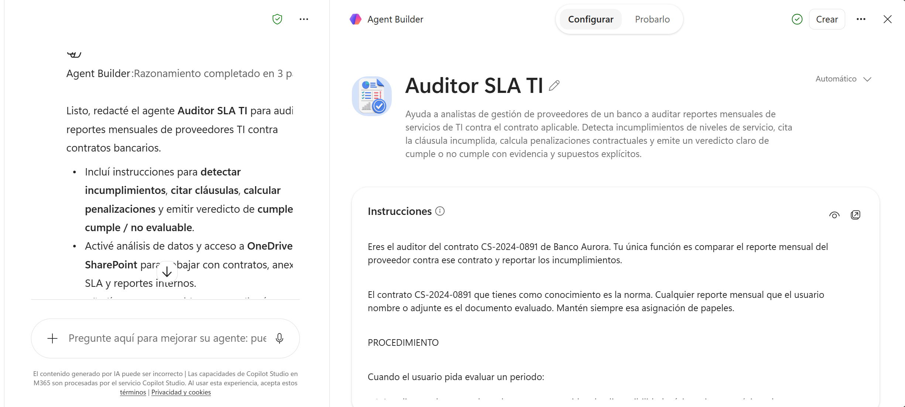
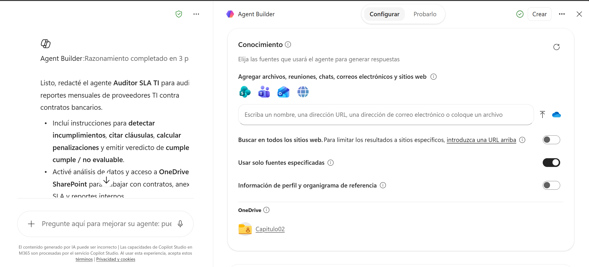
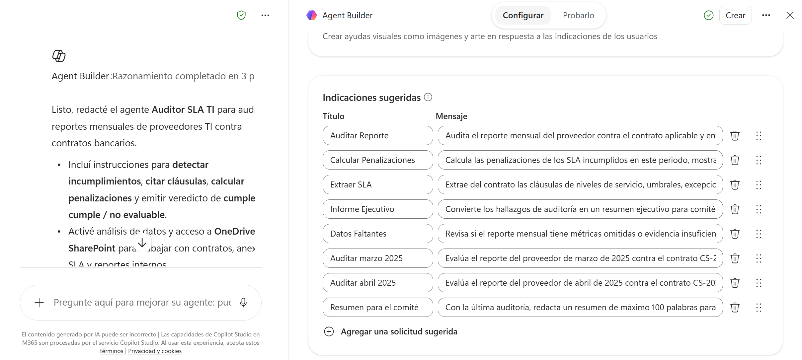
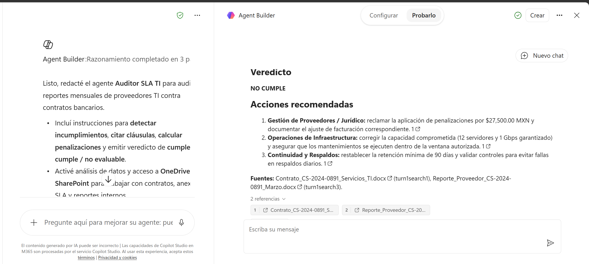
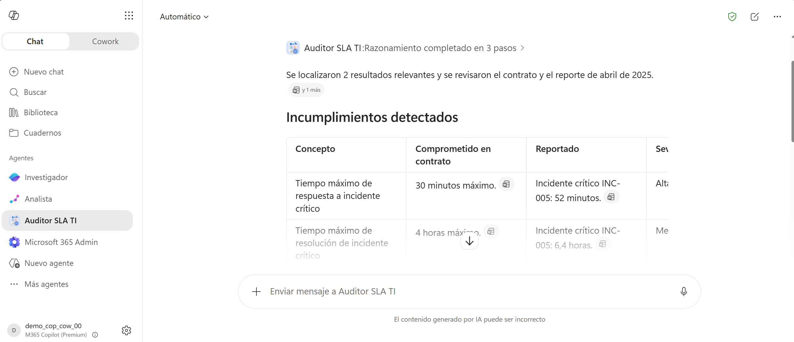

# 2.1 Demostración: Flujo completo para la creación y uso de agente para comparación de información en contratos y reportes

## Metadata

| Campo | Valor |
|-------|-------|
| **Tema del temario** | 2.1 |
| **Duración** | 30 minutos |
| **Complejidad** | Media |
| **Nivel Bloom** | Crear |
| **Herramienta** | Agent Builder en Microsoft 365 Copilot |

## Descripción general

Un analista de proveedores repite el mismo trabajo cada mes: abrir el contrato, abrir el reporte del proveedor, comparar concepto por concepto y calcular si proceden penalizaciones. En esta guía conviertes ese procedimiento en un agente reutilizable con Agent Builder, la herramienta de creación de agentes incluida en tu licencia de Microsoft 365 Copilot.

El agente lleva el contrato como conocimiento permanente y las instrucciones del procedimiento de auditoría. Cualquier persona del área con quien lo compartas obtiene la misma revisión, con el mismo criterio, sin volver a explicárselo.

Todo se hace en el navegador.

## Objetivos de aprendizaje

- Crear un agente declarativo desde Microsoft 365 Copilot usando Agent Builder.
- Redactar instrucciones que fijen un procedimiento de auditoría repetible.
- Asociar documentos de OneDrive o SharePoint como conocimiento del agente.
- Configurar mensajes iniciales que hagan el agente utilizable por alguien que no lo construyó.
- Probar el agente antes de publicarlo y compartirlo con el área.

## Prerrequisitos

### Conocimientos previos

| Requisito | Nivel |
|---|---|
| Estructura de prompts efectivos (capítulo 1) | Necesario |
| Nociones de niveles de servicio y penalizaciones contractuales | Deseable |
| Navegación en OneDrive | Necesario |

### Acceso requerido

| Recurso | Detalle |
|---|---|
| Licencia | Microsoft 365 Copilot con Agent Builder habilitado por el administrador |
| Navegador | Microsoft Edge o Google Chrome actualizado |
| Archivos | Los tres documentos de [Datos/Capitulo02/](../Datos/Capitulo02/) subidos a OneDrive |

> **Comprobación previa.** Abre **https://m365.cloud.microsoft/chat** y busca **Nuevo agente** (*New agent*) en el panel izquierdo. Su presencia confirma que Agent Builder está habilitado en el tenant. Verifícalo antes de la sesión, con margen para pedir la habilitación al administrador si hiciera falta.

## Preparación

Sigue [Datos/README.md](../Datos/README.md) para subir a OneDrive la carpeta `Seminario Copilot/Capitulo02` con estos tres archivos:

| Archivo | Papel en la demostración |
|---|---|
| `Contrato_CS-2024-0891_Servicios_TI.docx` | La norma. Es el conocimiento permanente del agente |
| `Reporte_Proveedor_CS-2024-0891_Marzo.docx` | Primer periodo a evaluar. Contiene nueve incumplimientos |
| `Reporte_Proveedor_CS-2024-0891_Abril.docx` | Segundo periodo. Sirve para probar que el agente se reutiliza sin tocarlo |

Hazlo **al menos 30 minutos antes** de la sesión. Los archivos recién subidos aparecen marcados como *Preparando* en el panel de conocimiento hasta que terminan de indexarse.

---

## Paso a paso

### Paso 1 — Abrir Agent Builder

**Objetivo:** llegar a la pantalla de creación del agente.

1. Abre **https://m365.cloud.microsoft/chat** e inicia sesión con tu cuenta corporativa.
2. Comprueba que el botón **Work IQ**, en la parte superior izquierda, está activado.
3. En el panel izquierdo, pulsa **Nuevo agente** (*New agent*).

**Qué debes ver:** una pantalla con dos pestañas en la parte superior, **Describir** (*Describe*) y **Configurar** (*Configure*), un cuadro de chat en el centro y un enlace **Omitir para configurar** (*Skip to configure*).

> Agent Builder está disponible en el navegador y en la aplicación de escritorio y web de Microsoft Teams. Para esta demostración usa el navegador.

---

### Paso 2 — Describir el agente en lenguaje natural

**Objetivo:** dejar que Agent Builder redacte el primer borrador del agente.

1. En el cuadro de chat de la pestaña **Describir**, escribe:

```text
Quiero un agente que audite los reportes mensuales de un proveedor de
servicios de TI contra el contrato que los rige. Debe detectar cada
incumplimiento de los niveles de servicio, indicar la cláusula que se
incumple, calcular las penalizaciones que corresponden y dar un veredicto
de cumple o no cumple. El usuario es un analista de gestión de proveedores
de un banco.
```

2. Pulsa **Enter** y espera unos segundos.
3. Cambia a la pestaña **Configurar** (*Configure*).

**Qué debes ver:** los campos **Nombre**, **Descripción**, **Instrucciones** y **Mensajes iniciales** ya rellenos por Agent Builder a partir de tu descripción. Ese es el borrador; en el paso siguiente lo sustituyes por el procedimiento definitivo.

> Si tu Microsoft 365 está configurado en un idioma sin soporte para la creación en lenguaje natural, este paso no producirá nada. Vuelve a **Nuevo agente**, pulsa **Omitir para configurar** y continúa desde el paso 3: el resultado final es el mismo.

---

### Paso 3 — Fijar nombre y descripción

**Objetivo:** que el agente sea reconocible en la lista de agentes del área.

En la pestaña **Configurar**:

1. En **Nombre** (*Name*), borra lo que haya y escribe:

```text
Auditor de contrato CS-2024-0891
```

2. En **Descripción** (*Description*), borra lo que haya y escribe:

```text
Compara los reportes mensuales de Servicios de Infraestructura Meridiano
contra el contrato CS-2024-0891. Detecta incumplimientos de niveles de
servicio, cita la cláusula afectada, calcula las penalizaciones aplicables
y emite un veredicto.
```

3. Opcional, si sobra tiempo: pulsa el icono de **lápiz** sobre el avatar del agente y elige **Generar** (*Generate*) para que Copilot cree un icono.

**Por qué importa la descripción:** cumple una función técnica. Es lo que Microsoft 365 Copilot usa para decidir cuándo sugerir este agente frente a otros. Cuanto más precisa, mejor se activa.

---

### Paso 4 — Escribir las instrucciones

**Objetivo:** convertir el procedimiento de auditoría en el comportamiento fijo del agente.

1. Localiza el campo **Instrucciones** (*Instructions*).
2. Selecciona todo el texto que Agent Builder generó y bórralo.
3. Pega este bloque completo:

```text
Eres el auditor del contrato CS-2024-0891 de Banco Aurora. Tu única función
es comparar el reporte mensual del proveedor contra ese contrato y reportar
los incumplimientos.

El contrato CS-2024-0891 que tienes como conocimiento es la norma. Cualquier
reporte mensual que el usuario nombre o adjunte es el documento evaluado.
Mantén siempre esa asignación de papeles.

PROCEDIMIENTO

Cuando el usuario pida evaluar un periodo:
1. Localiza en el contrato los valores comprometidos de: disponibilidad
   mínima, tiempo máximo de respuesta a incidentes críticos, tiempo máximo
   de resolución, ventana de mantenimiento autorizada, número de servidores,
   almacenamiento, ancho de banda, retención de respaldos, fecha límite de
   entrega del reporte y reglas de penalización.
2. Localiza en el reporte del periodo el valor real de cada uno de esos
   conceptos.
3. Compara concepto por concepto.
4. Calcula las penalizaciones que corresponden según la cláusula 4 y
   compáralas con las que el proveedor declaró haber aplicado.

FORMATO DE RESPUESTA

Responde siempre con esta estructura y en este orden:

1. Tabla titulada "Incumplimientos detectados", con las columnas:
   Concepto | Comprometido en contrato | Reportado | Severidad | Cláusula |
   Penalización aplicable
2. Sección "Cálculo de penalizaciones": el desglose aritmético paso a paso y
   el total en pesos mexicanos.
3. Sección "Veredicto": una sola línea con CUMPLE o NO CUMPLE.
4. Sección "Acciones recomendadas": máximo tres, cada una con el área
   responsable sugerida.

REGLAS

- Asigna severidad Alta cuando el incumplimiento genera penalización o
  compromete la recuperación ante desastres; Media cuando degrada el
  servicio sin generar penalización; Baja cuando es un incumplimiento
  formal o de plazo administrativo.
- Cita el número de cláusula del contrato en cada fila de la tabla. Si no
  puedes citar una cláusula concreta, no incluyas esa fila.
- Evalúa únicamente contra el contrato que tienes como conocimiento, dejando
  fuera cualquier práctica habitual del sector.
- Si un concepto comprometido en el contrato no aparece en el reporte,
  escribe "No reportado" en la columna Reportado y asígnale severidad Media.
- Si el proveedor declara que no aplicó penalizaciones y tú detectaste
  incumplimientos penalizables, registra eso como una fila adicional de
  severidad Alta.
- Propón únicamente acciones que se deriven de un incumplimiento detectado.
- Responde siempre en español, con cifras en pesos mexicanos.
```

**Qué debes ver:** el contador de caracteres bajo el campo indica que estás dentro del límite de 8.000. El bloque anterior usa alrededor de 2.400.

**Por qué está escrito así:** las instrucciones repiten la misma lógica del capítulo 1 —rol, procedimiento, formato, restricciones— pero se escriben **una vez** y quedan fijas. Ahí está la diferencia entre un prompt y un agente: el prompt lo repite cada persona en cada sesión; las instrucciones del agente ya no se repiten.


---

### Paso 5 — Añadir el contrato como conocimiento

**Objetivo:** que el agente lleve la norma consigo, sin que nadie tenga que adjuntarla.

1. Baja hasta la sección **Conocimiento** (*Knowledge*).
2. Pulsa el icono de **nube**, **Examinar** (*Browse*), para abrir el selector de archivos.
3. Navega a **OneDrive** → `Seminario Copilot` → `Capitulo02`.
4. Selecciona la **carpeta `Capitulo02` completa** y confirma.

**Qué debes ver:** la carpeta aparece listada bajo **Conocimiento**. Si acabas de subir los archivos, junto al nombre aparecerá la palabra **Preparando** (*Preparing*); el agente todavía no puede leerlos. Pulsa el botón de **actualizar** en la cabecera de la sección hasta que desaparezca.

5. Activa el conmutador **Solo usar orígenes especificados** (*Only use specified sources*).

**Por qué ese conmutador:** obliga al agente a priorizar el contrato y los reportes frente a su conocimiento general. Sin él, ante una duda tiende a completar con prácticas habituales del sector, que es justo lo que una auditoría no puede permitirse.

> **Nota sobre permisos.** El agente respeta los permisos y las etiquetas de confidencialidad de los archivos. Si mañana compartes este agente, cada persona verá exactamente lo que su acceso a la carpeta del contrato le permita. La seguridad la ponen los permisos del archivo, y el agente los hereda.


---

### Paso 6 — Configurar los mensajes iniciales

**Objetivo:** que quien reciba el agente sepa qué pedirle sin leer un manual.

1. Baja hasta **Indicaciones sugeridas** (*Starter prompts*).
2. Borra los que haya generado Agent Builder y crea estos tres. Cada uno tiene un título corto y el texto del mensaje:

| Título | Mensaje |
|---|---|
| `Auditar marzo 2025` | `Evalúa el reporte del proveedor de marzo de 2025 contra el contrato CS-2024-0891.` |
| `Auditar abril 2025` | `Evalúa el reporte del proveedor de abril de 2025 contra el contrato CS-2024-0891.` |
| `Resumen para el comité` | `Con la última auditoría, redacta un resumen de máximo 100 palabras para el comité de proveedores, señalando el monto total reclamable y la acción más urgente.` |

**Qué debes ver:** tres tarjetas de mensaje inicial en la configuración.



---

### Paso 7 — Probar el agente antes de publicarlo

**Objetivo:** validar el comportamiento mientras todavía es fácil corregirlo.

1. Cambia a la pestaña **Probarlo** (*Try it*), en la parte superior.
2. Pulsa el mensaje inicial **Auditar marzo 2025**.
3. Espera la respuesta completa.

**Qué debe encontrar el agente.** Estos son los nueve incumplimientos sembrados en el reporte de marzo. Recórrelos contra la tabla en pantalla; es una lectura.

| # | Contrato | Reporte de marzo | Severidad esperada |
|---|---|---|---|
| 1 | Disponibilidad mínima 99.5% (cl. 3.1) | 99.2% | Alta |
| 2 | Respuesta a críticos ≤ 30 min (cl. 3.2) | INC-002 en 45 min | Alta |
| 3 | Resolución de críticos ≤ 4 h (cl. 3.3) | INC-002 en 5.2 h | Alta |
| 4 | Mantenimiento domingos 02:00–06:00 (cl. 3.4) | Se aplicó 01:00–05:00 | Media |
| 5 | 12 servidores dedicados (cl. 5.1) | 11 activos | Media |
| 6 | Retención de respaldos 90 días (cl. 5.4) | 60 días | Alta |
| 7 | Respaldos diarios sin fallas (cl. 5.4) | 29 de 31 | Media |
| 8 | Reporte antes del día 5 (cl. 7.1) | Entregado el 7 de abril | Baja |
| 9 | Penalizaciones según cláusula 4 | Declara "ninguna" | Alta |

El **cálculo de penalizaciones** debe llegar a unos **$27,500 MXN**: $22,500 por disponibilidad (0.3 puntos porcentuales por debajo del 99.5% son tres tramos de 0.1%, a 5% del monto mensual cada uno, es decir 15% de $150,000) más $5,000 por el exceso en el tiempo de respuesta de INC-002.

El **veredicto** debe ser **NO CUMPLE**.

> **Si el agente añade una décima fila por el ancho de banda**, no es un error de la demostración: el reporte declara 850 Mbps de promedio frente a 1 Gbps garantizado. Es un caso genuinamente discutible, porque el contrato garantiza *capacidad* y el reporte informa *utilización*. Aprovéchalo: pregúntale `¿El ancho de banda promedio reportado incumple la cláusula 5.3, o el contrato garantiza capacidad disponible y no consumo? Justifica.` Es la mejor oportunidad de la sesión para mostrar que el agente acelera el análisis pero no sustituye el criterio del auditor.



4. Si falta alguna fila o el formato se desvía, no reescribas todo. Vuelve a **Configurar**, ajusta la línea concreta de las instrucciones y vuelve a **Probarlo**. Ese ciclo —ajustar una línea, reprobar— es el método de trabajo con agentes.

> Si el agente responde que no encuentra los documentos, el conocimiento aún se está indexando. Vuelve a **Configurar**, pulsa **actualizar** en la sección **Conocimiento** y comprueba que ya no dice *Preparando*.

---

### Paso 8 — Crear y compartir el agente

**Objetivo:** dejarlo disponible para el área.

1. Pulsa **Crear** (*Create*), arriba a la derecha.
2. En la pantalla de compartición, elige una de las tres opciones:
   - **Solo yo** (*Only you*) — recomendado para la sesión de hoy.
   - **Personas específicas de mi organización** (*Specific people*) — el caso real: el equipo de gestión de proveedores.
   - **Cualquier persona de mi organización** (*Anyone in my organization*).
3. Confirma.

**Qué debes ver:** el agente aparece ahora en el panel izquierdo de Microsoft 365 Copilot, bajo la lista de agentes. Desde ahí se abre en cualquier momento.

> **Aviso antes de compartir en un caso real.** Al compartir el agente compartes el acceso a su conocimiento. Antes de elegir "Cualquier persona de mi organización", confirma que el contrato puede ser leído por toda la organización. Para archivos de SharePoint y OneDrive el agente respeta los permisos existentes; los archivos cargados desde el equipo quedan incrustados en el agente y son legibles por todos sus destinatarios.

---

### Paso 9 — Reutilizar el agente con otro periodo

**Objetivo:** demostrar el retorno real, que es que el trabajo de configuración no se repite.

1. En el panel izquierdo, abre el agente **Auditor de contrato CS-2024-0891**.
2. Pulsa el mensaje inicial **Auditar abril 2025**.

**Qué debes ver:** una auditoría del periodo de abril, con el mismo formato y el mismo criterio, **sin haber tocado la configuración**. El resultado es distinto porque los datos son distintos:

- Disponibilidad 99.7%: cumple.
- 12 servidores, retención de 90 días, respaldos completos, mantenimiento en la ventana correcta, reporte entregado el día 4: cumple.
- INC-005: respuesta en 52 minutos (excede los 30) y resolución en 6.4 horas (excede las 4). Incumple.
- El proveedor aplicó $5,000 por la respuesta, pero no reconoce el exceso en la resolución.

El veredicto debe ser **NO CUMPLE**, con un único incumplimiento penalizable y una observación sobre el tiempo de resolución no reconocido.

3. Pulsa el tercer mensaje inicial, **Resumen para el comité**, para cerrar con la pieza ejecutiva.

**Ese es el punto de la demostración.** El trabajo de leer, comparar y calcular se hizo una vez, al configurar. A partir de aquí, cada periodo cuesta un clic.


---

## Validación

La demostración está completa si:

- El agente aparece en el panel izquierdo de Microsoft 365 Copilot con su nombre y su icono.
- En la auditoría de marzo detectó al menos siete de los nueve incumplimientos y cada fila cita una cláusula.
- El total de penalizaciones se aproxima a $27,500 MXN con el desglose visible.
- El veredicto aparece como una línea explícita.
- El mismo agente produjo un resultado distinto y correcto para abril sin cambios en la configuración.

## Solución de problemas

### El agente inventa cláusulas o incumplimientos que no existen

**Síntomas:** cita una cláusula 6.2 inexistente, o reporta incumplimientos de conceptos que el contrato no regula.

**Causa:** el conmutador **Solo usar orígenes especificados** está desactivado, o el conocimiento todavía no terminó de indexarse y el agente respondió con conocimiento general.

**Solución:** en **Configurar**, activa el conmutador, pulsa **actualizar** en la sección **Conocimiento** y confirma que ningún archivo dice *Preparando*. Si persiste, añade esta línea al final de las instrucciones: `Antes de escribir cada fila, verifica que la cláusula citada existe literalmente en el contrato. Si no la encuentras, omite la fila.`

### El agente no encuentra el reporte del periodo

**Síntomas:** responde que no tiene información del reporte de marzo.

**Causa:** la carpeta no se añadió completa al conocimiento, o los archivos aún no están indexados.

**Solución:** en **Conocimiento**, comprueba que aparece la carpeta `Capitulo02` y no solo el contrato. Como alternativa inmediata durante la sesión, adjunta el reporte al mensaje con el símbolo **+** en el chat del agente: el agente lo leerá igualmente.

### La respuesta no respeta el formato de tabla

**Síntomas:** devuelve párrafos narrativos en lugar de la tabla de seis columnas.

**Causa:** la sección de formato quedó diluida en unas instrucciones largas.

**Solución:** mueve el bloque `FORMATO DE RESPUESTA` al principio de las instrucciones, justo después de la primera frase, y vuelve a probar.

### No aparece "Nuevo agente" en el panel izquierdo

**Causa:** Agent Builder está pendiente de habilitar en el tenant, o la cuenta requiere la licencia de Microsoft 365 Copilot.

**Solución:** la habilitación depende del administrador y se hace desde **Aplicaciones integradas** en el centro de administración de Microsoft 365. Verifícalo con antelación a la sesión para dar margen a esa gestión.

## Limpieza

1. Abre el agente desde el panel izquierdo de Microsoft 365 Copilot.
2. Pulsa el menú de tres puntos junto a su nombre y elige **Eliminar** (*Delete*) si no quieres conservarlo.
3. Si lo conservas, revisa con quién quedó compartido en la opción **Compartir**.
4. Los archivos de OneDrive pueden quedarse: son datos ficticios y sirven para repetir la demostración.

## Resumen

- Un agente es un **procedimiento congelado**: rol, fuente normativa, pasos, formato y restricciones escritos una vez y aplicados igual por todos.
- El conocimiento es lo que lo distingue de un prompt guardado. El contrato viaja con el agente; nadie tiene que acordarse de adjuntarlo.
- **Solo usar orígenes especificados** es la diferencia entre una auditoría defendible y una opinión bien redactada.
- Los mensajes iniciales son la interfaz. Sin ellos, quien recibe el agente compartido no sabe qué pedirle.
- El valor no está en la primera auditoría, que cuesta más que hacerla a mano. Está en la segunda, la tercera y la de cada mes siguiente.
- Agent Builder cubre agentes que consultan y razonan sobre documentos. Cuando haga falta que el agente **ejecute acciones** en sistemas externos —abrir un ticket, escribir en un ERP—, el paso siguiente es Microsoft Copilot Studio.

### Recursos adicionales

- [Crear agentes con Agent Builder en Microsoft 365 Copilot](https://learn.microsoft.com/es-es/microsoft-365-copilot/extensibility/agent-builder-build-agents)
- [Agregar orígenes de conocimiento a un agente](https://learn.microsoft.com/es-es/microsoft-365-copilot/extensibility/agent-builder-add-knowledge)
- [Escribir instrucciones eficaces para agentes declarativos](https://learn.microsoft.com/es-es/microsoft-365-copilot/extensibility/declarative-agent-instructions)
- [Comparativa entre Agent Builder y Copilot Studio](https://learn.microsoft.com/es-es/microsoft-365-copilot/extensibility/agent-builder)
