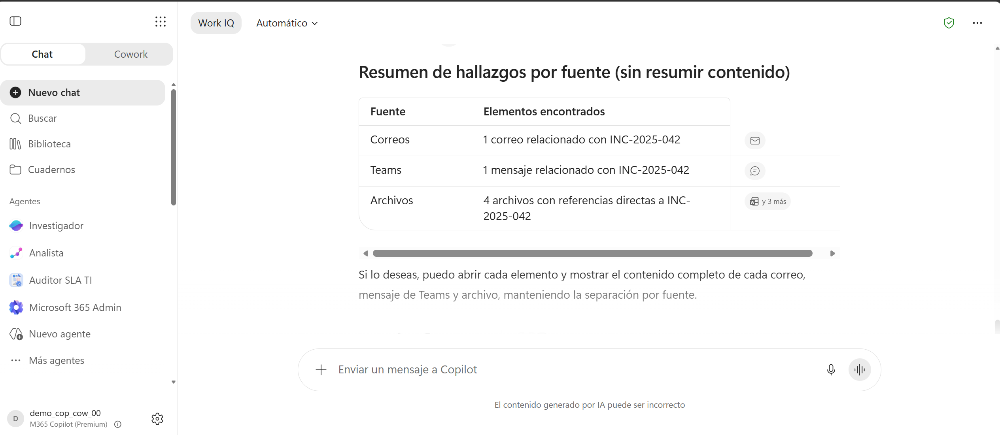
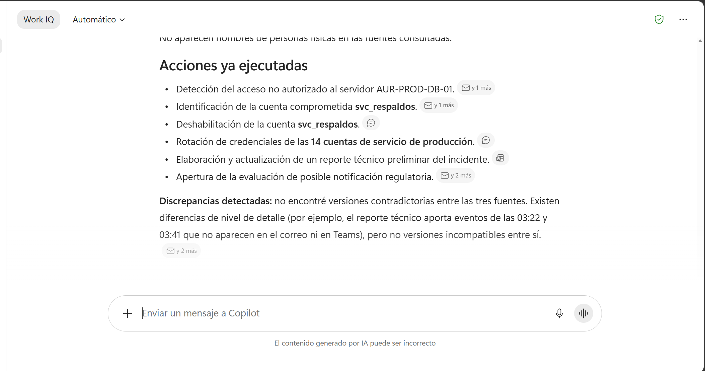
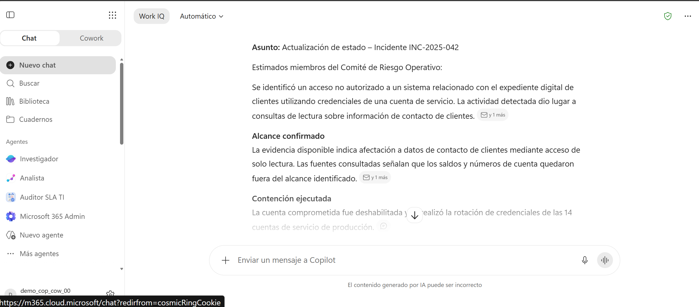
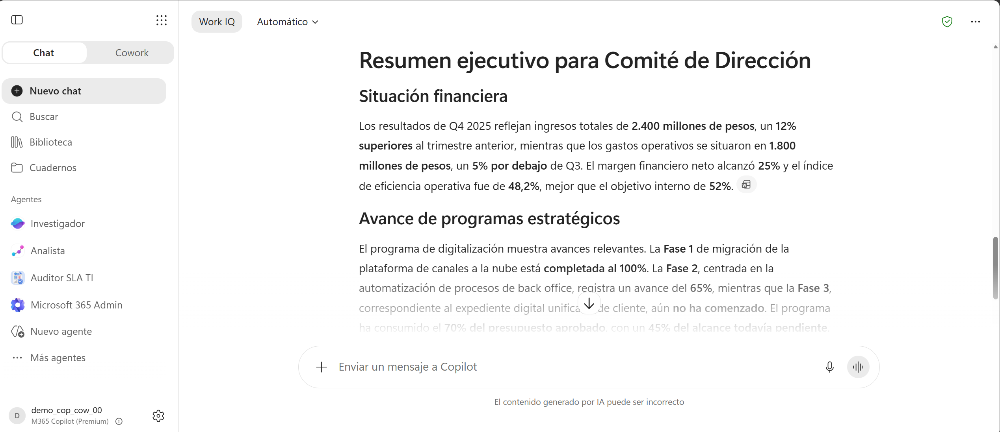
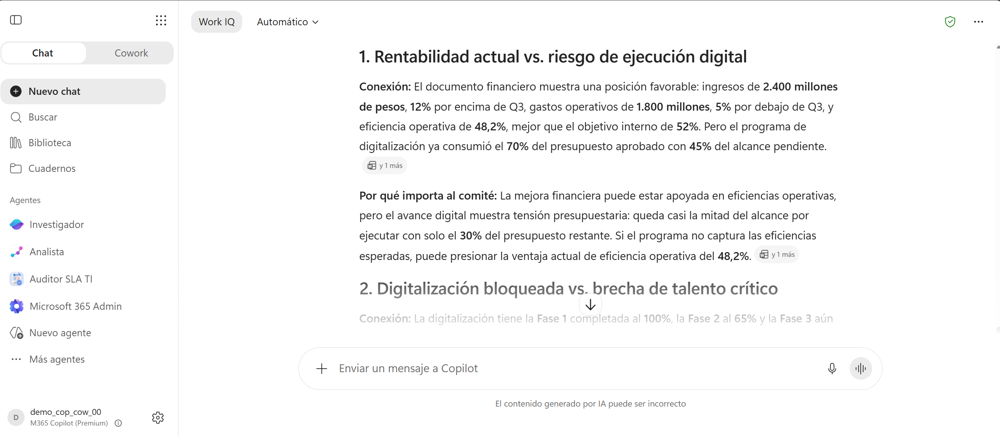
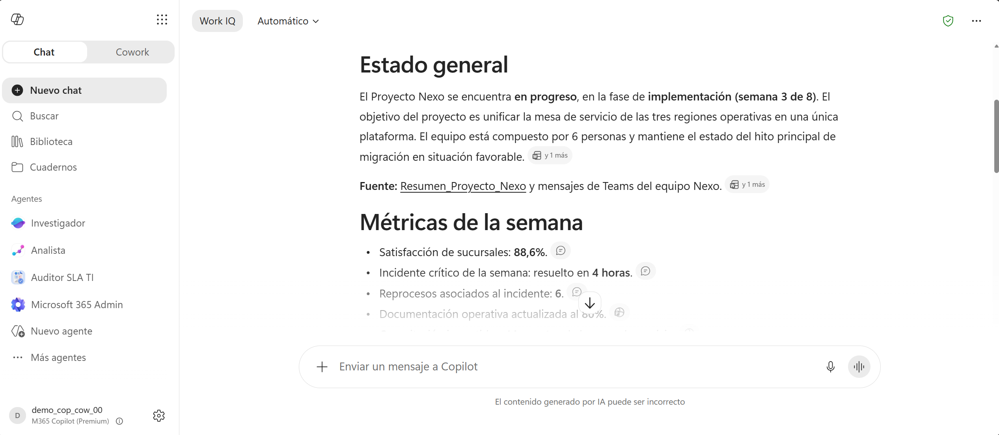
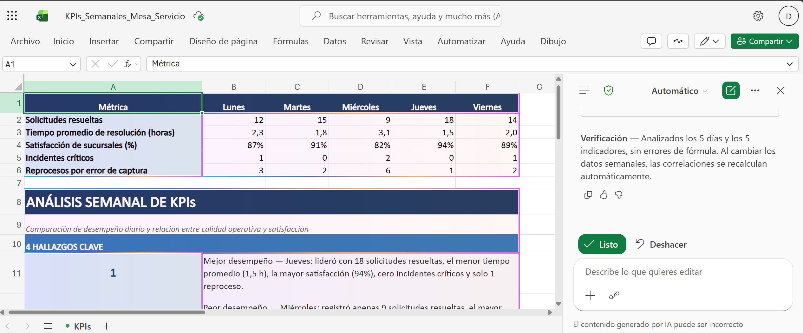
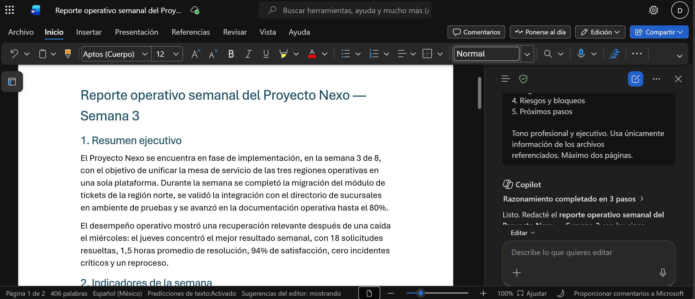
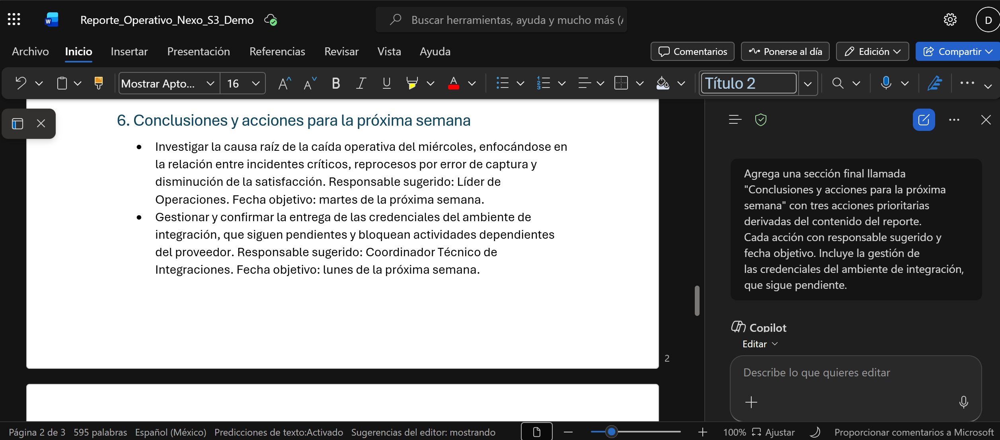

# Capítulo 3 — Análisis de información desde múltiples fuentes del ecosistema Microsoft

Tres guías donde Microsoft 365 Copilot consulta correo, chats y archivos a la vez. La lección 3.1 explica que eso ocurre a través de Microsoft Graph; aquí se observa el resultado desde el producto.

## Antes de empezar

1. Sube a OneDrive los archivos de [Datos/Capitulo03/](../Datos/Capitulo03/) siguiendo [Datos/README.md](../Datos/README.md).
2. Importa los correos `.eml` a Outlook y publica los mensajes de Teams, según indica cada guía.
3. Abre **https://m365.cloud.microsoft/chat** con el botón **Work IQ** activado.

> **La advertencia más importante de este capítulo.** Copilot encuentra correos, mensajes y archivos a través del índice de búsqueda de Microsoft 365, que se actualiza de forma asíncrona. Un correo importado hace dos minutos puede tardar entre 5 y 30 minutos en ser localizable. **Haz toda la preparación al menos 30 minutos antes de la sesión.** Cada guía indica la alternativa para cuando el índice va con retraso.

---

# 3.2 Demostración: Análisis de correos (Outlook), chats (Teams) y documentos (Word o PDF) relacionados con un incidente

## Metadata

| Campo | Valor |
|-------|-------|
| **Tema del temario** | 3.2 |
| **Duración** | 10 minutos |
| **Complejidad** | Media |
| **Nivel Bloom** | Analizar |
| **Herramienta** | Microsoft 365 Copilot (chat, con Work IQ activado) |

## Descripción general

La información de un incidente de seguridad vive repartida: hay un correo que lo escala, un hilo de Teams donde el equipo lo confirma y un reporte técnico en OneDrive. Reconstruir qué pasó exige abrir las tres cosas y ordenarlas mentalmente. En esta guía se lo pides a Copilot y obtienes la línea de tiempo consolidada, con la cita de cada fuente.

## Objetivos de aprendizaje

- Formular una consulta que obligue a Copilot a recorrer correo, Teams y archivos en una sola respuesta.
- Interpretar las citas de origen que Copilot adjunta a cada dato.
- Detectar, cruzando fuentes, los compromisos abiertos que cada fuente por separado deja implícitos.
- Producir la comunicación de seguimiento dentro del chat.

## Prerrequisitos

| Requisito | Detalle |
|---|---|
| Lección 3.1 | Contexto organizacional y Microsoft Graph |
| Licencia | Microsoft 365 Copilot activa |
| Preparación | Completada al menos 30 minutos antes (ver abajo) |

## Preparación (30 minutos antes de la sesión)

1. **Documento.** Sube `Reporte_Tecnico_INC-2025-042.docx` a `Seminario Copilot/Capitulo03` en tu OneDrive. Ábrelo una vez desde OneDrive para acelerar la indexación.
2. **Correo.** Importa `Correo_INC-2025-042.eml` a tu bandeja de entrada. El procedimiento está en [Datos/README.md](../Datos/README.md#cómo-importar-los-correos-eml-a-outlook).
3. **Teams.** Abre Microsoft Teams, entra en un canal al que pertenezcas o crea un chat de grupo de prueba, y publica el mensaje número 1 de `Mensajes_Teams_Capitulo03.txt`.

---

## Paso a paso

### Paso 1 — Pedir a Copilot que localice el incidente

**Objetivo:** comprobar que Copilot alcanza las tres fuentes.

1. En **https://m365.cloud.microsoft/chat**, con **Work IQ** activado, pulsa **Nuevo chat**.
2. Escribe, sin adjuntar nada:

```text
Busca todo lo que exista sobre el incidente INC-2025-042 en mis correos, en
mis mensajes de Teams y en mis archivos. Dime qué encontraste en cada una de
esas tres fuentes, con la fecha de cada elemento. Todavía no lo resumas.
```

3. Pulsa **Enter**.

**Qué debes ver:** una respuesta que menciona los tres elementos —el correo, el mensaje de Teams y el reporte técnico— con enlaces o referencias numeradas al pie. Ese listado es la demostración de que una sola pregunta atravesó Outlook, Teams y OneDrive.

> **Si Copilot localiza uno o dos elementos**, el índice va con retraso. Continúa la sesión: pulsa el símbolo **+** → **Agregar contenido de trabajo**, adjunta `Reporte_Tecnico_INC-2025-042.docx` y `Correos_Capitulo03.docx`, y sigue con el paso 2. Los pasos restantes funcionan igual con los documentos adjuntos.



---

### Paso 2 — Pedir la línea de tiempo consolidada

**Objetivo:** que Copilot ordene en un solo relato lo que está repartido en tres sitios.

1. En el mismo chat, escribe:

```text
Con esas tres fuentes, construye la línea de tiempo del incidente
INC-2025-042.

Formato: una tabla con las columnas Fecha y hora | Qué ocurrió | Fuente.
En la columna Fuente indica si el dato viene del correo, del mensaje de
Teams o del reporte técnico.

Debajo de la tabla añade tres apartados breves:
- "Alcance confirmado": qué se sabe con certeza sobre los datos afectados.
- "Personas involucradas".
- "Acciones ya ejecutadas".

Restricciones: usa solo información presente en las fuentes. Cuando un dato
aparezca en dos fuentes con distinta versión, señala la discrepancia en lugar
de elegir una. Responde en español.
```

2. Pulsa **Enter**.

**Qué debes ver:** una tabla que combina la cronología fina del reporte técnico (03:22 detección, 03:41 consultas, 04:05 fin de sesión, 07:50 escalamiento, 09:15 confirmación, 11:30 rotación de credenciales) con el escalamiento del correo y la confirmación del equipo en Teams. El alcance debe decir aproximadamente 4,200 registros de datos de contacto, con los saldos y números de cuenta fuera del alcance.


---

### Paso 3 — Extraer lo que cada fuente deja implícito

**Objetivo:** el paso donde aparece el valor real: cruzar, en lugar de resumir.

1. Escribe:

```text
Ahora dime qué compromisos siguen abiertos. Para cada uno indica quién lo
pidió, en qué fuente aparece, si hay evidencia en alguna otra fuente de que
ya se cumplió, y cuál es el plazo si se mencionó alguno.

Ordénalos poniendo primero los que tengan implicación regulatoria.
```

2. Pulsa **Enter**.

**Qué debes ver:** tres compromisos abiertos, encabezados por la decisión sobre la notificación regulatoria dentro del plazo de 72 horas, que aparece pedida en el correo y mencionada en Teams mientras las fuentes siguen sin registrar su resolución. También la revisión de accesos de las últimas 48 horas, pedida en el correo y todavía pendiente según el reporte.

Ese cruce —una petición en el correo que ninguna otra fuente cierra— es lo que se pierde cuando cada fuente se lee por separado.

---

### Paso 4 — Producir el entregable

**Objetivo:** cerrar con la comunicación que el responsable tendría que escribir.

1. Escribe:

```text
Redacta el correo de actualización de estado para el comité de riesgo
operativo. Máximo 200 palabras. Estructura: qué pasó en dos líneas, alcance
confirmado, qué ya se contuvo, qué sigue abierto con responsable y plazo, y
la decisión que necesito del comité. Tono ejecutivo, sin detalle técnico.
```

2. Pulsa **Enter**.

**Qué debes ver:** un correo listo para enviar, cuya sección de pendientes procede del cruce del paso 3.


---

## Validación

- La respuesta del paso 1 nombró elementos de las tres fuentes.
- La línea de tiempo indica el origen de cada hecho.
- Los compromisos abiertos incluyen la notificación regulatoria de 72 horas.
- El correo final cabe en 200 palabras y contiene una petición de decisión.

**Sobre los permisos:** todo lo que Copilot mostró son datos de tu propio buzón, tus chats y tus archivos. Un colega que ejecute la misma consulta obtendrá lo que su propio acceso le permita. Copilot opera con los permisos que ya tienes.

## Solución de problemas

**Copilot localiza el documento pero deja fuera el correo o el mensaje de Teams.** Causa: indexación pendiente. Solución: adjunta `Correos_Capitulo03.docx` con el símbolo **+** y continúa. Para forzar la búsqueda en el buzón, sé más literal: `Busca en mis correos el asunto que contenga INC-2025-042.`

**La línea de tiempo mezcla horas UTC y locales.** Causa: las fuentes usan referencias distintas. Solución: envía `Normaliza todas las horas a UTC e indica entre paréntesis la fuente de cada una.`

**Copilot añade detalles técnicos ajenos a las fuentes.** Solución: envía `Conserva solo las afirmaciones que puedas atribuir a una de las tres fuentes citadas.`

## Limpieza

1. Elimina el correo de prueba en Outlook y vacía **Elementos eliminados**.
2. En Teams, pasa el cursor sobre el mensaje publicado, pulsa los tres puntos (**⋯**) y elige **Eliminar**.
3. El documento puede quedarse en OneDrive: es ficticio y sirve para repetir la demostración.

## Resumen

- La consulta atravesó tres servicios desde una sola pregunta. Eso es el contexto organizacional en funcionamiento.
- Pedir la fuente de cada dato convierte la respuesta en algo verificable, que es lo que un comité necesita.
- El paso que aporta valor es el cruce. Un compromiso pedido en un correo que ningún otro documento cierra aparece solo cuando se miran las tres fuentes juntas.
- Copilot respeta los permisos existentes: ve exactamente lo que tú puedes ver.

---

# 3.3 Demostración: Generación de insights ejecutivos a partir de archivos en OneDrive y SharePoint

## Metadata

| Campo | Valor |
|-------|-------|
| **Tema del temario** | 3.3 |
| **Duración** | 10 minutos |
| **Complejidad** | Baja |
| **Nivel Bloom** | Analizar |
| **Herramienta** | Microsoft 365 Copilot (chat, con Work IQ activado) |

## Descripción general

Tres informes de tres áreas distintas —finanzas, proyectos y talento— llegan al comité de dirección por separado. Cada uno se entiende solo; el problema es que las decisiones dependen de lo que ocurre **entre** ellos. En esta guía consolidas los tres en un resumen ejecutivo y después pides a Copilot las conexiones que aparecen al mirarlos juntos.

## Objetivos de aprendizaje

- Consolidar varios documentos en un único resumen ejecutivo con un solo prompt.
- Verificar el origen de cada dato mediante las referencias de la respuesta.
- Profundizar en un hallazgo con preguntas de seguimiento que conservan el contexto.
- Obtener conexiones transversales entre documentos.

## Prerrequisitos

| Requisito | Detalle |
|---|---|
| Lección 3.1 | Contexto organizacional y Microsoft Graph |
| Archivos | `Resultados_Financieros_Q4.docx`, `Avance_Programa_Digitalizacion.docx` e `Indicadores_Talento_Enero.docx` en OneDrive |

---

## Paso a paso

### Paso 1 — Comprobar que Copilot alcanza los archivos

1. En **https://m365.cloud.microsoft/chat**, con **Work IQ** activado, pulsa **Nuevo chat**.
2. Escribe:

```text
¿Qué archivos tengo en mi OneDrive relacionados con resultados financieros,
el programa de digitalización o indicadores de talento? Dime el nombre, la
ubicación y la fecha de última modificación de cada uno.
```

3. Pulsa **Enter**.

**Qué debes ver:** los tres archivos listados con su ubicación y fecha, cada uno con un enlace en el que puedes hacer clic.

> Si aparecen menos de tres, adjunta los que falten con el símbolo **+** → **Agregar contenido de trabajo** antes del paso 2. La demostración funciona igual.

---

### Paso 2 — Pedir el resumen ejecutivo consolidado

1. Escribe:

```text
Con esos tres documentos, redacta el resumen ejecutivo de una página para el
comité de dirección.

Estructura:
- "Situación financiera"
- "Avance de programas estratégicos"
- "Capital humano"
- "Riesgos principales": exactamente 3, ordenados por gravedad.
- "Oportunidades": exactamente 3.

Restricciones: cada afirmación debe apoyarse en un dato de los documentos, con
la cifra. Limítate al contenido de esos tres archivos. Máximo 450 palabras.
Responde en español.
```

2. Pulsa **Enter**.

**Qué debes ver:** un documento estructurado con cifras concretas: 2,400 millones de ingresos con 12% de crecimiento, margen del 25%, índice de eficiencia del 48.2%, fase 2 del programa al 65% con el 70% del presupuesto ejecutado, 245 colaboradores con rotación del 1.2%. Entre los riesgos deben aparecer la concentración del 40% de los ingresos de banca empresarial en un solo grupo, el bloqueo de la integración con el core y la ausencia de plan de sucesión para tres posiciones directivas.

Al final de la respuesta, las **referencias** indican de qué archivo salió cada bloque. Abre una: es la prueba de la trazabilidad del dato.


---

### Paso 3 — Profundizar reutilizando el contexto

1. Escribe:

```text
Profundiza en el riesgo de concentración de ingresos. ¿Qué dato exacto del
documento financiero lo sustenta? Propón dos acciones de mitigación
concretas y di qué tendría que ocurrir para que ese riesgo se materialice.
```

2. Pulsa **Enter**.

**Qué debes ver:** la cita del 40% de los ingresos de banca empresarial concentrados en un grupo corporativo, más dos acciones de mitigación. Copilot mantiene la referencia a los documentos a lo largo de la conversación.

---

### Paso 4 — Pedir las conexiones entre documentos

**Objetivo:** el paso que justifica consolidar. Un resumen es la suma; esto es el producto.

1. Escribe:

```text
Ahora cruza los tres documentos. Dime tres conexiones entre ellos que
aparezcan solo al leerlos juntos, y por qué cada una debería importarle al
comité. Sé específico con las cifras de cada lado de la conexión.
```

2. Pulsa **Enter**.

**Qué debes ver:** conexiones del tipo: el programa de digitalización lleva el 70% del presupuesto ejecutado con el 45% del alcance pendiente mientras el índice de eficiencia mejora, lo que sugiere que la mejora tiene otro origen; las dos vacantes de arquitecto de integración desde noviembre son el mismo cuello de botella que bloquea la fase 2, y figuran en el documento de talento como un dato de plantilla; el 8% de la plantilla con certificación de prevención de lavado de dinero vencida es una exposición regulatoria que vive fuera del registro de riesgos financieros.

Esas tres frases se producen al consolidar, y en eso consiste el ejercicio.



---

## Validación

- El resumen contiene datos de los tres archivos con sus cifras.
- Las referencias al pie apuntan a los archivos correctos y se pueden abrir.
- La respuesta de seguimiento mantuvo el contexto.
- Las conexiones del paso 4 relacionan cifras de documentos distintos.

**Prueba opcional de permisos:** pide a un colega sin acceso a tu carpeta que haga la misma consulta. Obtendrá lo que su propio acceso le permita. Copilot consulta con los permisos de quien pregunta.

## Solución de problemas

**Copilot tarda en encontrar los archivos.** Causa: indexación pendiente, o los archivos están en OneDrive personal en lugar de OneDrive for Business. Solución: comprueba la cuenta y adjunta los archivos con el símbolo **+**.

**El resumen es correcto en estructura y genérico en contenido.** Síntoma: omite los 2,400 millones y el 65% de avance. Causa: Copilot respondió antes de leer los archivos. Solución: adjúntalos explícitamente y repite el prompt.

**Las conexiones del paso 4 resultan obvias.** Solución: acota más: `Las conexiones que diste son evidentes. Dame tres que requieran comparar una cifra de un documento con una cifra de otro, y nombra ambas cifras.`

## Limpieza

Los archivos son ficticios y pueden quedarse en OneDrive. Si prefieres retirarlos, elimina la carpeta y vacía la papelera de reciclaje de OneDrive.

## Resumen

- Un solo prompt consolidó tres documentos que normalmente se leen en tres momentos distintos.
- Las referencias al pie son el mecanismo de verificación: dan al resumen ejecutivo la trazabilidad que un comité exige.
- El contexto se conserva entre mensajes, así que profundizar cuesta una frase.
- El valor de consolidar está en que las conexiones entre áreas aparecen cuando los documentos se miran juntos.

---

# 3.4 Demostración: Generación de reportes operativos integrando información de Teams, Outlook, Excel, Word y PowerPoint almacenada en OneDrive y SharePoint

## Metadata

| Campo | Valor |
|-------|-------|
| **Tema del temario** | 3.4 |
| **Duración** | 15 minutos |
| **Complejidad** | Media |
| **Nivel Bloom** | Crear |
| **Herramienta** | Microsoft 365 Copilot en chat, en Excel y en Word |

## Descripción general

El reporte operativo semanal de un proyecto se arma hoy a mano: alguien abre el Excel de indicadores, el Word de estado, el PowerPoint de avance, revisa el correo del proveedor y el hilo de Teams, y lo teclea todo en un documento nuevo. En esta guía ese documento lo redacta Copilot, con Copilot dentro de Excel aportando el análisis y Copilot dentro de Word montando el entregable.

Es la demostración que cierra el seminario porque usa las tres formas de Copilot: el chat que consulta todo, y los copilotos integrados en las aplicaciones donde el trabajo ocurre.

## Objetivos de aprendizaje

- Obtener una síntesis que integre cinco servicios de Microsoft 365 en una sola respuesta.
- Usar Copilot en Excel para obtener análisis de tendencias sobre datos operativos.
- Generar un documento estructurado en Word con Copilot referenciando archivos concretos.
- Rastrear cada dato del reporte final hasta su servicio de origen.

## Prerrequisitos

| Requisito | Detalle |
|---|---|
| Lección 3.1 | Contexto organizacional y Microsoft Graph |
| Guías 3.2 y 3.3 | Recomendable haberlas visto |
| Licencia | Microsoft 365 Copilot activa, con Copilot visible en Excel y Word |

## Preparación (30 minutos antes de la sesión)

1. **Archivos.** Sube a `Seminario Copilot/Capitulo03` en OneDrive: `KPIs_Semanales_Mesa_Servicio.xlsx`, `Resumen_Proyecto_Nexo.docx` y `Avance_Semanal_Nexo.pptx`. Abre cada uno una vez desde OneDrive.
2. **Correo.** Importa `Correo_Proyecto_Nexo.eml` a tu bandeja de entrada, según [Datos/README.md](../Datos/README.md#cómo-importar-los-correos-eml-a-outlook).
3. **Teams.** Publica el mensaje número 2 de `Mensajes_Teams_Capitulo03.txt` en un canal o chat de grupo.

---

## Paso a paso

### Paso 1 — Síntesis multi-fuente en el chat

**Objetivo:** ver las cinco fuentes convergiendo en una respuesta.

1. En **https://m365.cloud.microsoft/chat**, con **Work IQ** activado, pulsa **Nuevo chat**.
2. Escribe:

```text
Resume el estado del Proyecto Nexo de esta semana consultando:
- Los archivos de mi OneDrive en la carpeta Seminario Copilot/Capitulo03
- Los correos que mencionen Proyecto Nexo
- Los mensajes de Teams sobre el equipo Nexo

Estructura: estado general, métricas de la semana, logros, bloqueos y
comunicaciones relevantes. Indica al final de cada apartado de qué archivo o
servicio salió la información.
```

3. Pulsa **Enter**.

**Qué debes ver:** un resumen que combina la fase 3 de 8 y los riesgos del Word, las métricas del Excel (18 solicitudes resueltas el jueves como máximo, 82% de satisfacción el miércoles como mínimo), los logros y bloqueos del PowerPoint, la reprogramación de la reunión del jueves del correo y el promedio del 88.6% del mensaje de Teams. Las referencias aparecen al pie.

> Si alguna fuente tarda en aparecer, adjunta los tres archivos y `Correos_Capitulo03.docx` con el símbolo **+** y repite el prompt.


---

### Paso 2 — Análisis de tendencias con Copilot en Excel

**Objetivo:** que el análisis numérico lo haga la herramienta que tiene los números.

1. Abre `KPIs_Semanales_Mesa_Servicio.xlsx` desde OneDrive. Se abre en Excel para la web.
2. En la pestaña **Inicio** de la cinta, pulsa el botón **Copilot**, a la derecha. Se abre un panel en el lateral derecho.
3. Si Excel propone convertir el rango en tabla, acepta: Copilot en Excel trabaja mejor sobre tablas.
4. En el panel, escribe:

```text
Analiza las tendencias de la semana. ¿Qué día tuvo el mejor desempeño y cuál
el peor? ¿Hay relación entre los incidentes críticos, los reprocesos por
error de captura y la satisfacción de sucursales? Resume los hallazgos en 4
puntos.
```

5. Pulsa **Enter**.

**Qué debes ver:** el jueves identificado como mejor día (18 solicitudes resueltas, 94% de satisfacción, 0 incidentes críticos, 1 reproceso) y el miércoles como peor (9 solicitudes, 82%, 2 incidentes, 6 reprocesos). Copilot debe señalar que los días con incidentes críticos coinciden con caídas de satisfacción y picos de reprocesos.



6. Deja el panel abierto: vas a usar estos hallazgos en el paso 4.

> Si el botón **Copilot** está ausente en la cinta de Excel, tu licencia cubre el chat pero requiere la extensión a las aplicaciones de Microsoft 365. Salta al paso 3 y pide el mismo análisis desde el chat adjuntando el archivo; el resultado es equivalente.


---

### Paso 3 — Redactar el reporte con Copilot en Word

**Objetivo:** montar el entregable dentro de la aplicación donde vive.

1. Abre una pestaña nueva y ve a **https://word.new**. Se crea un documento en blanco de Word para la web.
2. En el documento vacío aparece el cuadro **Redactar con Copilot**. Si prefieres invocarlo a mano, pulsa el icono de **Copilot** en la cinta y elige **Redactar con Copilot**.
3. Antes de escribir el prompt, referencia los archivos: escribe `/` en el cuadro y selecciona de la lista `KPIs_Semanales_Mesa_Servicio.xlsx`. Repite con `/` para `Resumen_Proyecto_Nexo.docx` y `Avance_Semanal_Nexo.pptx`.
4. A continuación, en el mismo cuadro, escribe el prompt:

```text
Redacta el reporte operativo semanal del Proyecto Nexo, semana 3, con estas
secciones numeradas:
1. Resumen ejecutivo
2. Indicadores de la semana, en tabla, con los datos del archivo de KPIs
3. Logros alcanzados
4. Riesgos y bloqueos
5. Próximos pasos

Tono profesional y ejecutivo. Usa únicamente información de los archivos
referenciados. Máximo dos páginas.
```

5. Pulsa **Generar** (*Generate*).
6. Revisa el borrador. Si te convence, pulsa **Conservar** (*Keep it*). Si prefieres otra versión, pulsa **Volver a generar** (*Regenerate*).

**Qué debes ver:** un documento con encabezados, una tabla de indicadores con las cifras reales del Excel, los logros de la presentación (migración del módulo de tickets de la región norte, integración con el directorio de sucursales, documentación al 80%, 14 agentes capacitados) y los riesgos del Word y del PowerPoint combinados.


---

### Paso 4 — Incorporar el análisis y cerrar

**Objetivo:** enriquecer el reporte con lo que salió de Excel y del correo.

1. Coloca el cursor al final de la tabla de indicadores.
2. Pulsa el icono de **Copilot** que aparece en el margen izquierdo de la línea, y escribe:

```text
Agrega un párrafo de análisis después de la tabla que señale: el jueves como
mejor día con 94% de satisfacción y cero incidentes, el miércoles como peor
día con 82%, dos incidentes críticos y seis reprocesos, y la relación entre
incidentes, reprocesos y caída de satisfacción. Cierra recomendando
investigar la causa raíz de lo ocurrido el miércoles.
```

3. Pulsa **Enter** y después **Conservar**.
4. Coloca el cursor al final del documento e invoca Copilot de nuevo:

```text
Agrega una sección final llamada "Conclusiones y acciones para la próxima
semana" con tres acciones prioritarias derivadas del contenido del reporte.
Cada acción con responsable sugerido y fecha objetivo. Incluye la gestión de
las credenciales del ambiente de integración, que sigue pendiente.
```

5. Guarda el documento: pulsa el nombre del archivo en la barra superior y renómbralo a `Reporte_Operativo_Nexo_S3`. Word para la web guarda automáticamente en tu OneDrive.


---

## Validación

Recorre el documento terminado y comprueba que puedes rastrear cada bloque hasta su origen:

| Contenido del reporte | Servicio de origen |
|---|---|
| Tabla de indicadores | Excel, en OneDrive |
| Fase, hitos y riesgos del proyecto | Word, en OneDrive |
| Logros y bloqueos técnicos | PowerPoint, en OneDrive |
| Reunión reprogramada con el proveedor | Outlook |
| Promedio de satisfacción del 88.6% | Teams |

La demostración está completa si el documento tiene las cinco secciones más las conclusiones, la tabla contiene las cifras reales del Excel y las acciones finales nombran responsable y fecha.

## Solución de problemas

**Copilot en Word tarda en ofrecer los archivos al escribir `/`.** Causa: la lista de `/` muestra primero los archivos usados recientemente. Solución: empieza a teclear el nombre para filtrar. Si sigue sin aparecer, abre el archivo una vez desde OneDrive y vuelve a intentarlo.

**El reporte tiene la estructura correcta y cifras distintas a las del Excel.** Causa: los archivos se quedaron sin referenciar. Solución: comprueba que los tres nombres aparecen como etiquetas dentro del cuadro de Copilot antes de pulsar Generar. Si el documento ya está generado, es más rápido rehacerlo que corregirlo.

**El documento sale demasiado largo.** Solución: selecciona el texto sobrante, pulsa el icono de Copilot y pide `Resume esta sección a la mitad conservando todas las cifras.`

**Copilot está ausente en Word o en Excel.** Causa: la licencia cubre el chat, y su extensión a las aplicaciones depende del despliegue de la organización. Solución: haz los pasos 3 y 4 desde el chat de Microsoft 365 Copilot adjuntando los archivos, y lleva el resultado a Word.

## Limpieza

1. Conserva la carpeta `Seminario Copilot` si vas a repetir la demostración.
2. Elimina el correo de prueba y el mensaje de Teams cuando ya no los necesites.
3. El reporte generado puede quedarse como muestra de referencia.

## Resumen

- Un solo reporte consolidó información de cinco aplicaciones desde un único punto de trabajo.
- Cada Copilot aporta lo suyo: el chat localiza y cruza, el de Excel analiza los números donde están, el de Word monta el entregable con el formato del documento.
- Referenciar archivos con `/` en Word es lo que separa un texto plausible de un reporte con las cifras correctas.
- Lo que hace funcionar este flujo es el contexto organizacional: los mismos permisos, el mismo índice y los mismos archivos que ya usa la persona.
- El reporte sigue necesitando revisión humana antes de circular. Copilot resuelve el trabajo mecánico; el criterio sobre qué se comunica al comité sigue siendo del responsable.

### Recursos adicionales

- [Microsoft 365 Copilot: información general](https://learn.microsoft.com/es-es/copilot/microsoft-365/microsoft-365-copilot-overview)
- [Copilot en Word](https://support.microsoft.com/es-es/office/bienvenido-a-copilot-en-word-2135e85f-a467-463b-b2f0-c51a46d625d1)
- [Copilot en Excel](https://support.microsoft.com/es-es/office/introducci%C3%B3n-a-copilot-en-excel-d7110502-0334-4b4f-a175-a73abdfc118a)
- [Datos, privacidad y seguridad en Microsoft 365 Copilot](https://learn.microsoft.com/es-es/copilot/microsoft-365/microsoft-365-copilot-privacy)
